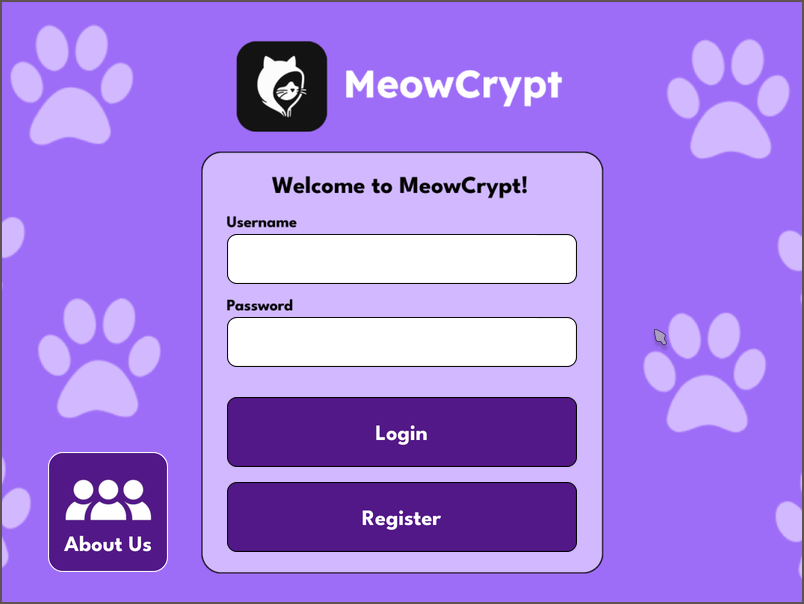

## MeowCrypt is still under construction!

# The MeowCrypt
### Key features:
- Credentials feature with hashed password stored to sqlite3 local database (to fullfill one of our subject).
- Text and file encryption using Fernet.
- Meowovert (convert common characters into cat meows).




### RKS A 2024 Kelompok 5
- Arya Senapati Rabbani (4332401024)
- Christin Agatha Purba (4332401030)
- Muhammad Rizki Pradana (4332401029)

MeowCrypt dependencies:
- [Git](https://git-scm.com/downloads)
- [SQLite](https://sqlite.org/download.html)
- [Python](https://www.python.org/downloads/)
- [Pyperclip (Python Package)](https://pypi.org/project/pyperclip/)
- [Cryptography (Python Package)](https://pypi.org/project/cryptography/)


#### Run on your favorite terminal program
>assuming you have already installed most of the dependencies

Install the required python packages
```
pip install pyperclip cryptography
```


Be in your preferred directory to access the program, then clone the repository
```
git clone https://github.com/LisenHatson/meowcrypt.git
```


move to the repository directory
```
cd meowcrypt
```


execute the code
```
python ./meowcrypt.py
```
